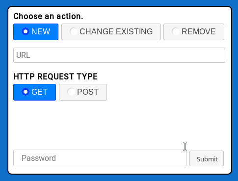
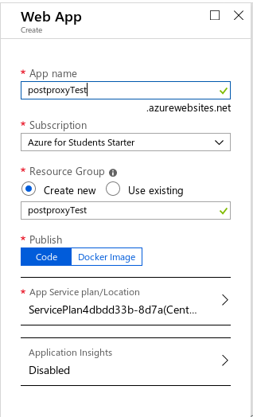
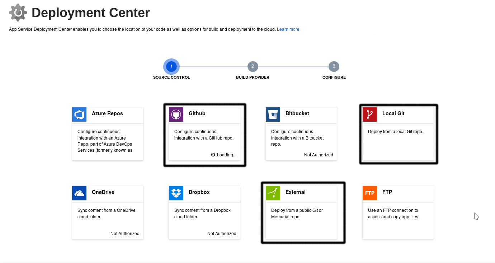
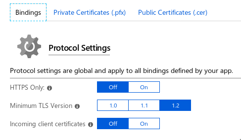
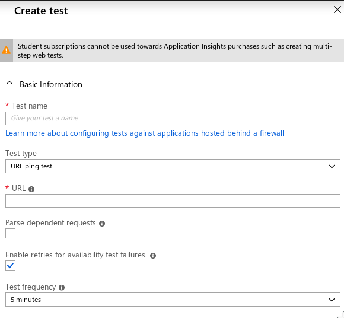

# POSTproxy
POSTproxy is a small application built on Node js which allows users to proxy POST/GET requests to some URL from a single device id. Device ids are unique and should a user wish to change what URL their device id is associated with, it can be done inside the web interface. Currently there is no way to view the currently added URLs. This application is designed for use with a small number of projects which will need to regularly send requests. This is for use with projects which either require an extra handshake to get data elsewhere (i.e. Iridium Sat-com) or where it might be wise to have a configurable end location such as a long term multi system project.

## How to Use
Using POST is simple. To add a new URL, click the new button at the top and input the URL to proxy requests to. Set which kind of request to send to said URL and input the password for your setup of POSTproxy. To change the URL of a device id, input everything the same as before but input what your device id is. The URL will be changed if the device id given is found among the registered devices. 

<p align="center">

</p>

## How to Setup
This guide to setting up POSTproxy is for Microsoft Azure cloud services. This guide will assume the user has made a Microsoft azure account and has at least a free service subscription.

### GUI
Create a new resource and search for web application service. Select "Web App" and fill in the boxes.

<p align="center">

</p>

Once the application has been created, navigate to it and select Deployment Center under Deployment in the application dashboard. From here there are a few methods of deploying the application. Select "GitHub" to link your github account and select a repo to deploy. Fork this repo and deploy your repo using this method. Select external repo to link to this repo using the URL and deploy or select local git to deploy a local clone of the application. 

<p align="center">

</p>

After waiting for azure to finish deploying the application, you will be ready to configure the application to work. 

Navigate to SSL settings under Settings for the application and toggle on HTTPS only.

<p align="center">

</p>

Now navigate to Configuration under Settings for the application and select "New application setting". Under name put "WEBSITE_NODE_DEFAULT_VERSION" and under value enter the latest node version available to your azure deployment. To find out your possible versions navigate to "<YOUR WEB APP NAME>.scm.azurewebsites.net/api/diagnostics/runtime" which will list out all the node versions available to you. 

<p align="center">

</p>

Now your application is running and will begin processing any requests. Unfortunately Azure will unload your application if your application is inactive for 5-20min. The delay of starting a web app that has been unloaded can cause redelivery issues so we will go over how to keep the application loaded.

If you are using a payed basic service subscription, you can use the "Always On" settings under the General settings tab in Configuration under Settings of your application. Alternatively you can set up a ping test to simulate traffic to the site. To do this create a new resource called "Application Insights". Give this new resource a name and navigate to it. Select "Avaliability" under Investigate and create a new test. Give this test a descriptive name and supply a URL to your website instance. Make sure that the "Enable retries" box is checked and that the Test frequency is set to 5 minutes. 

<p align="center">

</p>

## Set Up New Password
A single password is stored in a bcrypt salted hash towards the top of app.js. To set up a new password, a new hash will need to be generated and placed in the app.js. To generate a new password open a js console with node js running and bcrypt installed. Require bcrypt with `const bcrypt = require('bcrypt');` and then enter:

```javascript
bcrypt.hash("MY PASSWORD HERE", 10, function(err, hash) { 
    console.log(hash);
}); 
```
Copy and paste the printed hash in the hashed password var at the top of app.js and you are done.
