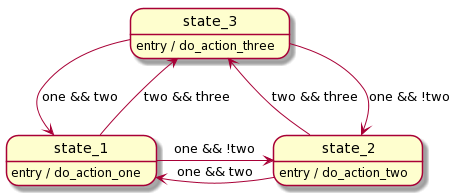

# SatComm Design Choices

You may have noticed that the `SatComm`-related modules are structured differently from the rest of the SlideSentinel codebase. As SatComm is isolated from the rest of the codebase, we chose it as a petri dish to test a number of new techniques for embedded firmware development. These techniques aimed to solve common problems found in other projects within the OPEnS Lab, mainly related to increasing reliability and decreasing tech debt. This document will outline the two main techniques used in SatComm--state machines and unit testing--and will explore the impacts of applying them to our code.

For more information on the SatComm modules themselves (SatCommController and SatCommDriver), please see [SatCommDiagrams](./lib/SatComm/SatCommDiagrams.md).

## State Machines
The SS team has found the behavior of SS devices is very accurately represented with a [finite state machine](https://en.wikipedia.org/wiki/Finite-state_machine) due to the cyclical and repetitive nature of our system. State machines split the code into two parts--action and transition--allowing the SS team to modularize the logic between what interactions happen and how the state changes. State machines are also generally more readable and easier to describe than a complicated if block. Take this if block for example:
```C++
if (one) {
    if (two)
        do_action_one();
    else if (three)
        do_action_two();
}
else if (two && three)
    do_action_three();
```
By approaching this if block like a state machine, we can create a [UML diagram](https://www.uml-diagrams.org/) to describe it's behavior:


<!--```plantuml
@startuml
skinparam defaultFontName Verdana
hide empty description

state state_1
state state_2
state state_3

state_1 -left-> state_2 : one && !two
state_1 -up-> state_3 : two && three
state_2 -left-> state_1 : one && two
state_2 -left-> state_3 : two && three
state_3 -down-> state_1 : one && two
state_3 -right-> state_2 : one && !two

state_1 : entry / do_action_one
state_2 : entry / do_action_two
state_3 : entry / do_action_three
```-->

This diagram is approachable by everyone, and allows the SS team to convey the behavior of our system without using code. It also allows the SS team to check for logic errors before throwing our backs into the implementation. With this diagram, we can use a simple switch statement pattern to re-implement the above if block into the state machine we derived:
```C++
switch(state) {
case state_1:
    // action
    do_action_one();
    // transition
    if (one && !two)
        state = state_2;
    else if (two && three)
        state = state_3;
    break;
case state_2:
    // action
    do_action_two();
    // transition
    if (one && two)
        state = state_1;
    else if (two && three)
        state = state_3;
    break;
case state_3:
    // action
    do_action_three();
    // transition
    if (one && two)
        state = state_2;
    else if (one && !two)
        state = state_3;
    break;
}
```

### TinyFSM

While the switch statement pattern allows us to quickly express our state machine, it's is also monolithic: the entire state machine logic must sit in a single file, generating long and impossible to verify state machines for complicated interactions. In addition, the above implementation is polling based as opposed to event based--in other words, each state periodically checks a condition rather than waiting for an event--making the implementation harder to model using a state machine, which always takes an event-based approach. To address these issues, many libraries have come up with clever ways of building state machines: [StateChart](https://www.boost.org/doc/libs/1_36_0/libs/statechart/doc/index.html), [QPCpp](https://www.state-machine.com/qpcpp/), and [TinyFSM](https://github.com/digint/tinyfsm) are examples of libraries the SS team reviewed.

As an experiment to improve technical debt, SatComm state machines are implemented using [TinyFSM](https://github.com/digint/tinyfsm). TinyFSM allows the SS team to implement an event-based state machine system, reducing the distance between the UML diagram and the implementation. In addition, TinyFSM allows for uncomplicated interactions between state machines, allowing the SS team to split large state machines into multiple smaller state machine that work together. For more information on TinyFSM, please refer to it's own wonderful [documentation](https://digint.ch/tinyfsm/doc/introduction.html), which is a highly recommended read to understand the SatComm codebase.

#### Implementation Notes

There are a few modifications the SS team has made to TinyFSM to allow for greater feature functionality:
 * `State::transit` has been replaced with the `TRANSIT` macro, which allows us to log state transitions.
 * `Fsm::dispatch` has been replaced with `EventQueue` to allow for run-to-completion event behavior. See [EventQueue](./lib/SatComm/EventQueue.h) for more information.
 * All state machines are templated, allowing for replacement of the event bus at compile time. This feature is especially important for testing, as it allows us to isolate the inputs and outputs of single state machine.


## Unit Testing

A common question asked right before a field test is: "Will this work, and how do you know?". At the SS team, we continually found that due to the frequency of code changes and difficulty of testing the system, we would only know the answer to this question after the field test. This was less than ideal, as it slowed development and lead to the need for additional field testing if the test failed. To address this issue, the SS team implemented [Unit Testing](https://en.wikipedia.org/wiki/Software_testing#Unit_testing) and [Continuous Integration](https://en.wikipedia.org/wiki/Software_testing#Continuous_testing) on the SatComm modules. These two techniques are commonly used in conjunction by complicated projects such as [v8](https://v8.dev/) to automatically verify changes made to the codebase. Unit testing allows the SS team to automatically verify the codebase in small chunks ("units"), providing an indicator other than smoke testing that the code is functioning properly. Continuous integration processes all available unit tests every time the repository is updated, giving the SS team immediate feedback on the functionality of pushed code.

### Unit Testing State Machines

Using the abstractions granted by TinyFSM, the SS team can unit test each state transition for all state machines. Unit tests for state machines are implemented by applying a known sequence of input events, then checking order and content of output events from the state machine, as recommended by [Testing State Machines](https://accu.org/index.php/journals/1548). More information on the state machine testing tools can be found in [DebugEventBus](./test/test_common/DebugEventBus.h).

### Implementation Notes

Unit testing in this project is implemented using [PlatformIO Test](https://docs.platformio.org/en/latest/plus/unit-testing.html), with all unit tests located under [test](./test). Tests are configured to run on the `adafruit_feather_m0_debug` environment and the `native` environment. The `native` environment is much faster than running tests on a feather, but it cannot run tests that use hardware devices, and as a result some tests are disabled for it. In addition, a test that starts with `Dangerous` requires human interaction and is disabled by default.

CI is implemented through [TravisCI](https://travis-ci.org/github/OPEnSLab-OSU/SlideSentinel). Travis is configured to run tests both in the `native` environment and the `adafruit_feather_m0_debug` environment using [PlatformIO Remote](https://docs.platformio.org/en/latest/plus/pio-remote.html). Remote `adafruit_feather_m0_debug` testing is supported by a physical server in Noah's house attached to a Feather M0 (and has been disabled for the summer while Noah is gone).