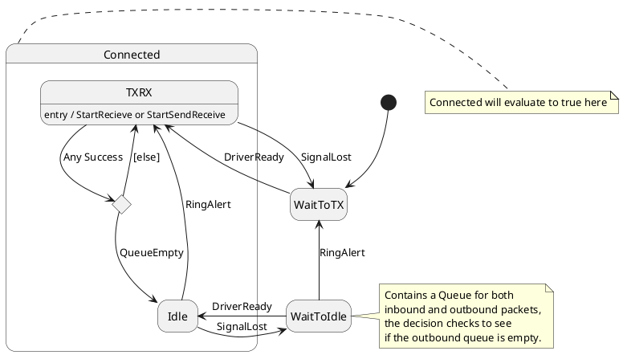
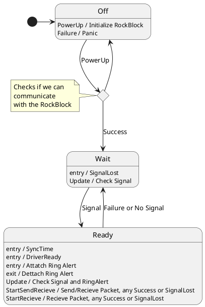
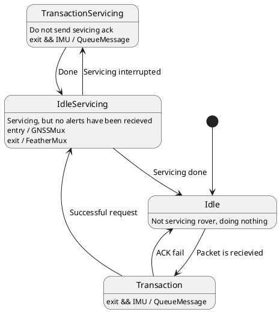
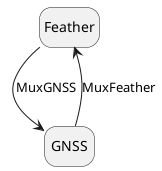

SatCommController

```plantuml
@startuml
skinparam defaultFontName Verdana
hide empty description

[*] --> WaitToTX
state WaitToIdle
state Connected {
    WaitToTX -left-> TXRX : DriverReady
    state CheckQueue <<choice>>
    CheckQueue --> TXRX : [else]
    TXRX --> CheckQueue : Any Success
    Idle --> TXRX : RingAlert
    Idle -right-> WaitToIdle : SignalLost
    WaitToIdle -left-> Idle : DriverReady
    CheckQueue --> Idle : QueueEmpty
    TXRX --> WaitToTX : SignalLost
    WaitToIdle -up-> WaitToTX : RingAlert
}

TXRX : entry / StartRecieve or StartSendReceive

note right of Connected
Connected will evaluate to true here
end note

note right of WaitToIdle
Contains a Queue for both
inbound and outbound packets,
the decision checks to see
if the outbound queue is empty.
end note
@enduml
```

SatCommDriver

```plantuml
@startuml
skinparam defaultFontName Verdana
hide empty description

[*] -right-> Off
state PowerUpChoice <<choice>>
Off --> PowerUpChoice : PowerUp
PowerUpChoice --> Wait : Success
PowerUpChoice --> Off
Wait --> Ready : Signal
Ready --> Wait : Failure or No Signal

Off : PowerUp / Initialize RockBlock
Off : Failure / Panic
Wait : entry / SignalLost
Wait : Update / Check Signal
Ready : entry / SyncTime
Ready : entry / DriverReady
Ready : entry / Attatch Ring Alert
Ready : exit / Dettach Ring Alert
Ready : Update / Check Signal and RingAlert
Ready : StartSendRecieve / Send/Recieve Packet, any Success or SignalLost
Ready : StartRecieve / Recieve Packet, any Success or SignalLost

note left of PowerUpChoice 
Checks if we can 
communicate
with the RockBlock
endnote
@enduml
```

COM Controller

```plantuml
@startuml
skinparam defaultFontName Verdana
hide empty description

state TransactionServicing : Do not send sevicing ack
state Idle : Not servicing rover, doing nothing
state IdleServicing : Servicing, but no alerts have been recieved
IdleServicing : entry / GNSSMux
IdleServicing : exit / FeatherMux
Transaction : exit && IMU / QueueMessage
TransactionServicing : exit && IMU / QueueMessage

[*] --> Idle
Idle --> Transaction : Packet is recievied
Transaction --> Idle : ACK fail
Transaction --> IdleServicing : Successful request
IdleServicing --> TransactionServicing : Servicing interrupted
IdleServicing --> Idle : Servicing done
TransactionServicing --> IdleServicing : Done
```

Multiplexer:

```plantuml
@startuml
skinparam defaultFontName Verdana
hide empty description

state Feather
state GNSS

Feather --> GNSS : MuxGNSS
GNSS --> Feather : MuxFeather
```