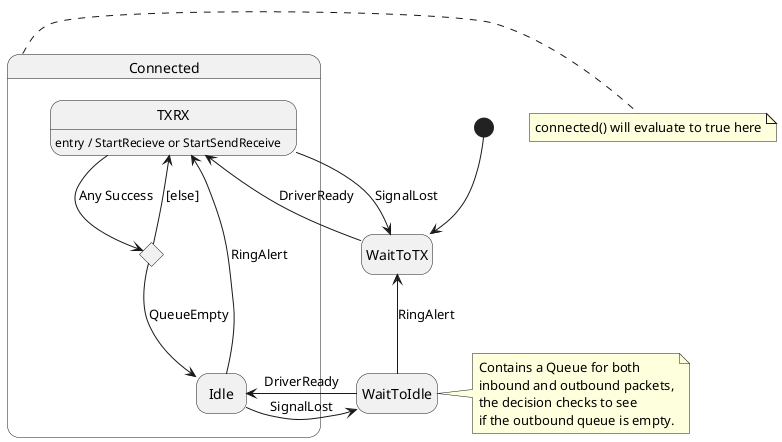
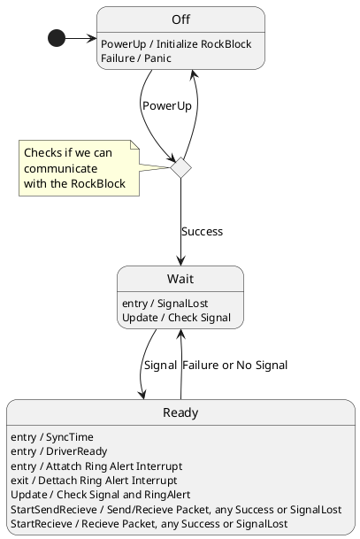

# SatComm Functionality Overview

The SatComm implementation is split into two state machines: SatCommController and SatCommDriver. SatCommController is designed to only handle business logic, dispatching events to SatCommDriver to handle hardware interactions. This split allows the business logic to be unit tested separately from hardware interactions, which are notoriously difficult to test with. These diagrams can be viewed using [PlantUML](https://plantuml.com/).

For more information on state machines and testing, please see [SatCommArchitecture](../../SatCommArchitecture.md).

## SatComm Controller

## SatCommDriver
