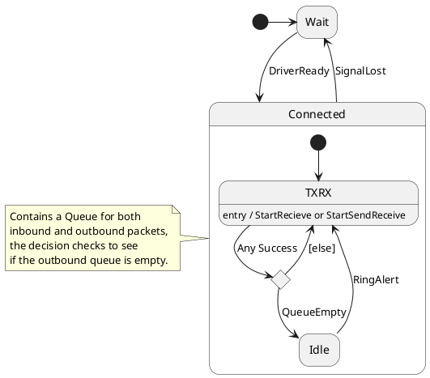
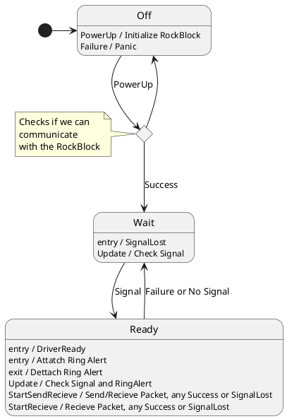

SatCommController

```plantuml
@startuml
skinparam defaultFontName Verdana
hide empty description

[*] -right-> Wait
Wait --> Connected : DriverReady
Connected --> Wait : SignalLost
state Connected {
    state CheckQueue <<choice>>
    [*] --> TXRX
    CheckQueue --> TXRX : [else]
    TXRX --> CheckQueue : Any Success
    Idle -up-> TXRX : RingAlert
    CheckQueue --> Idle : QueueEmpty
}

TXRX : entry / StartRecieve or StartSendReceive

note left of Connected 
Contains a Queue for both
inbound and outbound packets,
the decision checks to see
if the outbound queue is empty.
end note
@enduml
```

SatCommDriver

```plantuml
@startuml
skinparam defaultFontName Verdana
hide empty description

[*] -right-> Off
state PowerUpChoice <<choice>>
Off --> PowerUpChoice : PowerUp
PowerUpChoice --> Wait : Success
PowerUpChoice --> Off
Wait --> Ready : Signal
Ready --> Wait : Failure or No Signal

Off : PowerUp / Initialize RockBlock
Off : Failure / Panic
Wait : entry / SignalLost
Wait : Update / Check Signal
Ready : entry / DriverReady
Ready : entry / Attatch Ring Alert
Ready : exit / Dettach Ring Alert
Ready : Update / Check Signal and RingAlert
Ready : StartSendRecieve / Send/Recieve Packet, any Success or SignalLost
Ready : StartRecieve / Recieve Packet, any Success or SignalLost

note left of PowerUpChoice 
Checks if we can 
communicate
with the RockBlock
endnote
@enduml
```